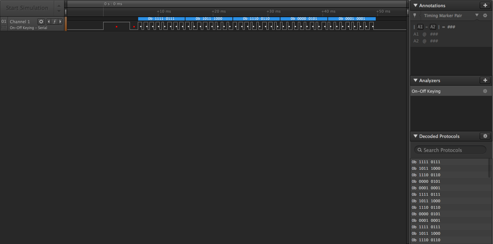

# On-Off keying (OOK) encoder for Saleae Logic Analyzer

Tested on macOS Sierra.

This project created, because I wanted to reverse engineer a 433 MHz RF rolling shutter protocol.

The device uses some sort of PIC, hooked directly to a transistor which is switching the carrier wave as far as I'am aware.

The PIC generating the OOK signal directly, so i hooked up the Saleae logic analyzer. No encoder can decode the signal, so I have to make one from Saleae open source SampleAnalyzer SDK.
The code is little bit shitty because i don't had much time for it, but it works ;)

The sample rate must be 20M/s.

I attached a sample file which is recorder from the transmitter device itself.


A lot of material came from here: https://forum.mysensors.org/topic/7/controlling-blinds-com-rf-dooya-motors-with-arduino-and-vera/44 and here: https://www.electroschematics.com/433mhz-rf-sniffer/

```html
The transmission consist of 12x5 Byte packet except the stop transmission 
which consist of 6x5 byte packet.

First the button pressed command repeated by 6 times, after that the button released 
command is also repeated by 6 times. Again the stop transmission is an exception, where 
is only the pressed command send 6 times.


Protocol
-----------------------------------------------------
               ID                 Channel    Command
11110111 10111000 11100110 0000  |  0101  |  00010001
-----------------------------------------------------

ID
--
28 bit identifier unique to remote. I assume this part is gets learned by the receiver.

Channel
-------
0101 - 0x05 ch1
0100 - 0x04 ch2
0011 - 0x03 ch3
0010 - 0x02 ch4
0001 - 0x01 ch5
0000 - all channel transmit

Commands
--------
00010001 -> Up btn pressed
00110011 -> Down btn pressed
01010101 -> Stop pressed

00011110 -> Up btn released
00111100 -> Down btn released
```


Note - This repository contains a submodule. Be sure to include submodules when cloning, for example `git clone --recursive https://github.com/k7000i/OOKAnalyzer.git`. If you download the repository from Github, the submodules are not included. In that case you will also need to download the AnalyzerSDK repository linked above and place the AnalyzerSDK folder inside of the OOKAnalyzer folder.

The project needs to be built. Run the following command:

```bash
python build_analyzer.py
```

After that, you need to enable the scripting socket and also in the Logic app Preferences-->Developer browse /OOKAnalyzer/debug

The `logic_custom.sh` script is launching a python script which loads the sample data file, and launching the Logic app at the same time.

To run the project
``` bash
chmod +x logic_custom.sh
./logic_custom.sh
```
